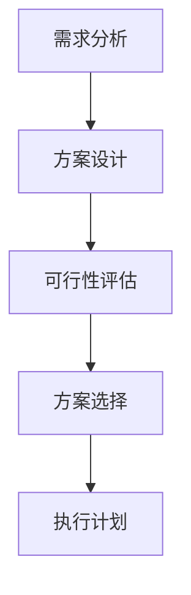

# Strategy Plugin

## Overview
策略插件负责任务分解、指令文件创建和优先级排序。它在CRCT系统中扮演着规划和决策的角色。

## 主要职责

### 1. 任务分解
- 将复杂任务分解为可管理的子任务
- 建立任务之间的依赖关系
- 确定任务执行顺序

### 2. 策略制定
- 制定任务执行策略
- 评估不同方案的可行性
- 选择最优实现路径

### 3. 资源规划
- 评估任务所需资源
- 分配开发资源
- 制定时间计划

## 工作流程

### 1. 需求分析
1. 理解任务需求
2. 确定技术约束
3. 识别关键点

### 2. 任务分解
1. 拆分子任务
2. 建立任务关系图
3. 定义任务边界

### 3. 策略制定
1. 评估技术方案
2. 选择实现路径
3. 制定执行计划

## 核心功能

### 1. 策略设计


### 2. 任务管理
- 创建任务说明文件
- 维护任务依赖关系
- 跟踪任务进度

### 3. 风险控制
- 识别潜在风险
- 制定应对策略
- 监控风险指标

## 指令文件模板

### Task Instructions Template
```markdown
# {Task Name} Instructions

## Objective
{Clear task objective}

## Context
{Background and context}

## Dependencies
{List of dependencies}

## Steps
1. {Step details}
2. {Step details}
...

## Expected Output
{Deliverables}

## Notes
{Additional information}

## Mini Dependency Tracker
{Dependencies grid}
```

## 优先级管理

### 1. 优先级评估标准
- 业务重要性
- 技术依赖
- 资源可用性
- 时间限制

### 2. 优先级矩阵
|  紧急程度  | 重要 | 不重要 |
|-----------|------|--------|
|   紧急    |  P0  |   P1   |
| 不紧急    |  P2  |   P3   |

### 3. 优先级调整机制
- 定期评估
- 动态调整
- 资源再分配

## 执行指南

### 1. 方案评估
- 技术可行性
- 资源需求
- 时间估算
- 风险评估

### 2. 决策制定
- 基于数据分析
- 考虑多个方案
- 权衡利弊
- 达成共识

### 3. 计划执行
- 明确里程碑
- 制定时间表
- 分配资源
- 监控进度

## 最佳实践

### 1. 策略制定
- 保持策略灵活性
- 考虑长期影响
- 注重可扩展性

### 2. 任务管理
- 清晰的任务边界
- 合理的任务粒度
- 完整的依赖分析

### 3. 风险管理
- 提前识别风险
- 制定备选方案
- 及时调整策略

## 注意事项

### 1. 策略调整
- 及时响应变化
- 灵活调整计划
- 持续优化方案

### 2. 沟通协作
- 保持信息透明
- 促进团队协作
- 及时反馈

### 3. 质量保证
- 遵循开发规范
- 确保代码质量
- 完善测试覆盖
